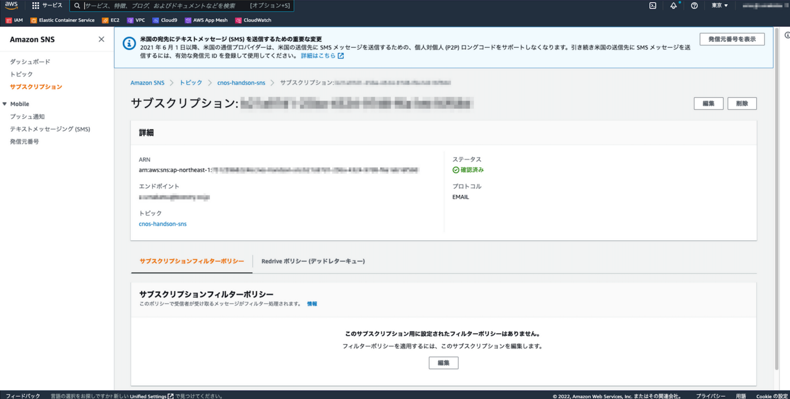

# クラウドネイティブオブザーバビリティストーリー/サンプルコード

## Overview

本リポジトリでは「Amazon CloudWatch [本格]入門 ~クラウドネイティブオブザーバビリティストーリー」の各章で実施する**事前準備/リソース削除**の手順を提供しています。
また、各章共通で利用するAWS Cloud9(以降、Cloud9)や、Amazon SNS(以降、SNS)の利用手順等も記載しています。
ハンズオン実施時にご活用ください。

## ハンズオン実施に向けて
ここでは、本書のハンズオンを実施するための準備事項を記載します。

### 前提事項
- AWSアカウントを所有していること
- AdministratorAccessポリシー相当のIAMユーザーもしくはIAMロールで作業可能なこと

### 共通で利用するCloud9の作成
まず、各章共通で利用するCloud9の作成に入ります。
Cloud9のセットアップには、AWS公式から提供されている、「[Copilot Primer Workshop](https://catalog.us-east-1.prod.workshops.aws/workshops/d03316be-3c29-49db-8dc3-eb196c1778c9/ja-JP/chapter2/content1)」を利用します。
ワークショップ内の内容説明も含まれているため、**Copilot Primer Workshopの「Cloud9 と IAM の準備」のみ**実施をしてください。

**本ハンズオン向けに2点注意事項**があります。
1. 名前は混乱を避けるために次のように設定してください。

| サービス    | 名称              |
| ----------- | ----------------- |
| Cloud9      | cnos-handson-dev  |
| IAMユーザー | cnos-handson-user |

2. [認証情報設定](https://catalog.us-east-1.prod.workshops.aws/workshops/d03316be-3c29-49db-8dc3-eb196c1778c9/ja-JP/chapter2/content3#)でコマンド実行時のAWSリージョンを指定する箇所があります。**リージョン名は「ap-northeast-1」を指定**してください。


なお、手順の中で[Copilot のインストール](https://catalog.us-east-1.prod.workshops.aws/workshops/d03316be-3c29-49db-8dc3-eb196c1778c9/ja-JP/chapter2/content3#copilot)があります。
Copilotについては、本書の各章ハンズオンでも利用します。そのためCopilotも手順どおりにインストールをしてください。

### 本書で利用する各種ツールをCloud9にインストール

#### 便利ツール
Cloud9 IDEを開き、画面下部のコマンドラインにて以下を入力します。

```bash
sudo yum -y install tree jq
```

#### AWS CLIのバージョンアップ
次にAWS CLIを最新にします。2022年9月時点で実施時は次のバージョンがCloud9にインストールされています。コマンドはCloud9 IDEの画面下部のコマンドラインから実行してください。

```bash
$ aws --version
aws-cli/1.19.112 Python/2.7.18 Linux/4.14.290-217.505.amzn2.x86_64 botocore/1.20.112
```

バージョン1が利用されています。現在の最新はバージョン2であるため移行しましょう。
最初に、バージョン1のAWS CLIを削除します。

```bash
# AWS CLIを削除
$ sudo yum -y remove awscli

# 削除されたことを確認
$ aws --version
bash: /usr/bin/aws: No such file or directory
```

次に、バージョン2のAWS CLIをインストールします。

```bash
# バイナリが含まれるzipファイルをダウンロード
$ curl "https://awscli.amazonaws.com/awscli-exe-linux-x86_64.zip" -o "awscliv2.zip"

# ダウンロードしたzipを解凍
$ unzip awscliv2.zip

# バイナリをインストール
$ sudo ./aws/install --bin-dir /usr/local/bin --install-dir /usr/local/aws-cli --update

# バージョン2のAWS CLIがインストールされたことを確認
$ aws --version
aws-cli/2.7.29 Python/3.9.11 Linux/4.14.290-217.505.amzn2.x86_64 exe/x86_64.amzn.2 prompt/off
```

以上で、AWS CLIのバージョンアップが完了です。

#### Goのインストール
最後に、Go(Go言語)のバージョンアップをします。
Cloud9ではデフォルト状態でGolangがインストールされています。

```bash
$ go version
go version go1.18.3 linux/amd64
```

Go1.18がインストールされていますね。
しかし、今回のハンズオンではGo1.19を利用しています。
Go1.19をインストールしていきましょう。

Cloud9 IDEを開き、画面下部のコマンドラインにて以下を入力します。

```bash
$ export GO_VERSION=1.19

# Goバイナリのダウンロード
$ wget https://golang.org/dl/go${GO_VERSION}.linux-amd64.tar.gz

# 展開してバイナリを配置
$ sudo rm -rf /usr/local/go && sudo tar -C /usr/local -xzf go${GO_VERSION}.linux-amd64.tar.gz && rm -f go${GO_VERSION}.linux-amd64.tar.gz

# 最新のGoバイナリに置き換え
$ echo 'export PATH=$PATH:/usr/local/go/bin' >> ~/.bash_profile && echo "alias go='/usr/local/go/bin/go'" >> ~/.bash_profile && cat ~/.bash_profile | tail && source ~/.bash_profile  

# バージョン確認
$ go version
go version go1.19 linux/amd64
```

以上で、Goのインストールが完了です。

### 共通で利用するSNSの作成
今回のハンズオンでは、「SNS」の機能を利用して設定したメールアドレスにメールを送信します。
複数の章で利用するSNSの設定を実施しておきましょう。

#### トピックの作成

1. AWSマネジメントコンソール上部の[サービス]タブより[SNS]と入力し、SNSダッシュボード画面に移動します。
2. 左ペインの[トピック]を選択し、[トピックの作成]を押します。
3. トピックの設定画面で次のように入力し、[トピックの作成]を押します。

| 項目グループ             | 項目名 | 値               |
| ------------------------ | ------ | ---------------- |
| 詳細                     | 名前   | cnos-handson-sns |
|                          | 表示名 | CNOS-SNS         |
| 暗号化                   |        | 変更なし         |
| アクセスポリシー         |        | 変更なし         |
| 配信再試行ポリシー       |        | 変更なし         |
| 配信ステータスのログ記録 |        | 変更なし         |
| タグ                     |        | 変更なし         |

4. 完了画面が表示されることを確認してください。


#### サブスクリプションの作成

1. [トピックの作成]完了画面から、サブスクリプションを作成します。トピックの作成完了画面にある[サブスクリプションの作成]を押します。
2. サブスクリプションの設定画面で次のように入力し、[サブスクリプションの作成]を押します。

| 項目グループ                         | 項目名         | 値                             |
| ------------------------------------ | -------------- | ------------------------------ |
| 詳細                                 | トピックARN    | 変更なし                       |
|                                      | プロトコル     | Eメール                        |
|                                      | エンドポイント | 利用可能なメールアドレスを入力 |
| サブスクリプションフィルターポリシー |                | 変更なし                       |
| Redriveポリシー                      |                | 変更なし                       |

3. 完了画面が表示されることを確認してください。



4. 入力したメールアドレスを確認し、メールアドレスの確認リンク(Confirm subscription)を押します。
5. サブスクリプション確認画面(Subscription confirmed)が表示されていることを確認します。
6. AWSマネジメントコンソールへ戻り、作成したトピックの画面に移動します。
7. [サブスクリプションタブ]を選択し、1つのサブスクリプションが表示されており、ステータスが確認済みとなっていればOKです。[メッセージの発行]ボタンから入力したメールアドレスにメールを送信して有効となっていることを確認ができます。

メール送信のためのSNSの設定は以上です。

## 注意事項

- 本リポジトリは不定期にバージョンアップを行います。READMEのバージョン情報を適宜ご参照ください。
- IaCサービス利用により、以下のAWSサービスが作成されます。料金が発生するサービスも含まれており、各IaCサービス用 README.md に従ってリソースの削除をオススメします。
  - リソースを作成したまま1ヶ月放置すると、東京リージョン(ap-northeast-1)で**約¥13,000程度請求されてしまう**ので、消し忘れにご注意ください($1=¥110換算、消費税なし)。


## 免責事項

- 本リポジトリ（以降、`o11y-story-code`）は利用者ご自身の判断と責任において行われるものとします。

- `o11y-story-code`の各種情報等については、慎重に作成、管理し、正確性を保つようには努めていますが、万一記載情報が事実と異なる場合は、Issueを作成していただけると幸いです。

- `o11y-story-code`の内容の全部または一部を事前の告知なしに変更する場合があります。

- `o11y-story-code`上から入手された情報により発生したあらゆる損害に関して一切の責任を負いません。 ここに掲載する情報およびリンクが設定されている他のサイトから取得された各種情報の利用によって生じたあらゆる損害に関しても一切の責任を負いません。

- `o11y-story-code`にに登場するシステム名や製品名は、関係各社の商標または登録商標です。また本書では、™、®、©などのマークは省略しています。
