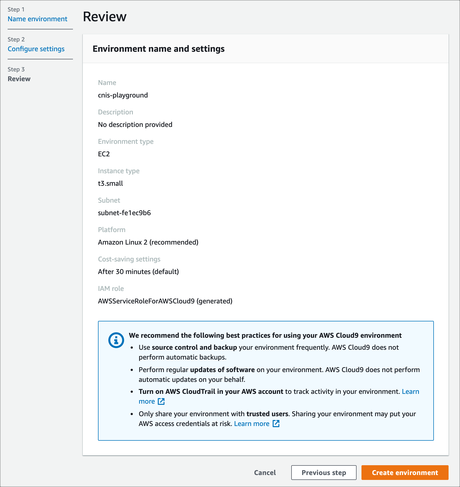
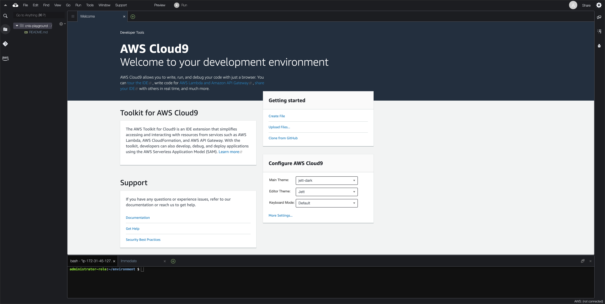
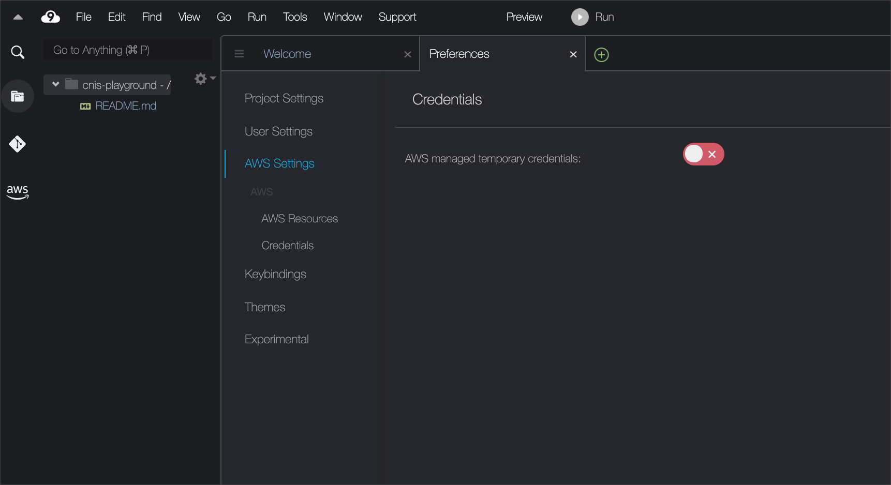

# クラウドネイティブオブザーバビリティストーリー/サンプルコード

## Overview

本リポジトリでは「Amazon CloudWatch [本格]入門 ~クラウドネイティブオブザーバビリティストーリー」の各章で実施する**事前準備/リソース削除**の手順を提供しています。
また、各章共通で利用するAWS Cloud9(以降、Cloud9)や、Amazon SNS(以降、SNS)の利用手順等も記載しています。
ハンズオン実施時にご活用ください。

## ハンズオン動作検証済みの各ソフトウェアバージョン

|ソフトウェア|バージョン|
|-|-|
|Python| 3.9.11|
|Go| 1.19|
|AWS CLI| 2.7.29|
|AWS SAM| 1.33.0|
|Copilot CLI|1.21.0|
|jq|v1.5|
|tree| 1.6.0|

## ハンズオン実施に向けて

ここでは、本書のハンズオンを実施するための準備事項を記載します。

### 前提事項

- AWSアカウントを所有していること
- AdministratorAccessポリシー相当のIAMユーザーもしくはIAMロールで作業可能なこと

### 共通で利用するCloud9の作成

まず、各章共通で利用するAWS Cloud9(以降、Cloud9）インスタンスを作成します。

1. AWSマネジメントコンソール上部の [サービス] タブより [Cloud9] を選択します。
2. Cloud9ダッシュボードの左側ナビゲーションメニューから [Account environments] を選択し、[Create environment] ボタンを押します。
3. Step1 [Name environment] では、次のように各項目を入力後、 [Next step] ボタンを押します。

| 項目名      | 値               |
| ----------- | ---------------- |
| Name        | cnos-handson-dev |
| Description | (入力なし)       |

4. Step2 [Configure settings] では、次のように各項目を入力・選択後、 [Next step] ボタンを押します。
ネットワークVPC及びサブネットはデフォルトのものを選択してください（デフォルトVPCが存在しない場合、インターネットに接続可能なVPCとサブネットを選択してください）。

| 項目名              | 値                                                       |
| ------------------- | -------------------------------------------------------- |
| Environment type    | Create a new EC2 instance for environment(direct access) |
| Instance type       | t3.small(2 GiB RAM + 2 vCPU)                             |
| Platform            | Amazon Linux2 (recommended)                              |
| Cost-saving setting | After 30 minutes(default)                                |
| Network(VPC)        | vpc-xxxxxxx(default) ※インターネットに接続可能なVPC      |
| Subnet              | subnet-xxxxxxx                                           | Default in ap-northeast-1a |

5. [Review] にて入力内容を確認し、 [Create environment] ボタンを押します。



6. 以下のようにCloud9コンソールが利用可能であることを確認してください。



#### インスタンスロールのアタッチ

Cloud9ではマネジメントコンソールにログインしたIAMユーザーの権限で自動的に認証権限が設定される仕組みを持っています。
これは AWS Managed Temporary Credentials(以降「AMTC」と略します) と呼ばれています。

[AWS Managed Temporary Credentials](https://docs.aws.amazon.com/ja_jp/cloud9/latest/user-guide/how-cloud9-with-iam.html#auth-and-access-control-temporary-managed-credentials)

IAMロール等の付与等も不要であるため便利なのですが、一部のAWS API操作に制限があるため、今回は作成したCloud9インスタンスにAdministratorAccess相当のIAMポリシーを持つインスタンスロールを付与することで代替します。

1. AWSマネジメントコンソールのトップ画面上部の [サービス] タブより [IAM] を 選択します。
2. IAMダッシュボードの左側ナビゲーションメニューから [ロール] を選択し、表示画面上部の [ロールを追加] ボタンを押下します。
3. Step1 [信頼されたエンティティを選択] では、次表の項目を選択後、[次へ] ボタンを 押下します。

|項目名|値|
|-|-|
|信頼されたエンティティタイプ|AWSのサービス|
|ユースケース|EC2|

4. Step2 [許可を追加] では、[AdministratorAccess] にチェックを入れた後、[次へ] ボタンを押下します。
5. Step3 [名前、確認、および作成] では、次表の項目を選択後、[ロールを作成] ボタンを 押下します。

|項目名|値|
|-|-|
|ロール名|cnos-cloud9-role|
|説明|Allows EC2 instances to call AWS services on your behalf.|

6. AWSマネジメントコンソールのトップ画面上部の [サービス] タブより [EC2] を 選択します。
7. IAMダッシュボードの左側ナビゲーションメニューから [インスタンス] を選択し、インスタンス一覧画面から [aws-cloud9-cnos-handson-dev-xxxx] のインスタンス名にチェックをいれてください。
8. [アクション] → [セキュリティ] → [IAMロールを変更] を選択します。
9 [IAMロルを変更]にて、IAMロール名として先程作成した [cnos-cloud9-role] を選択し [IAMロールの更新] ボタンを押下します。
10. 成功の旨が確認できたらインスタンスロールのアタッチは完了です。

#### AMTCの無効化

まず Cloud9でAMTCを無効化して、AWS管理の一時認証情報を無効化します。

1. AWSマネジメントコンソールのトップ 画面上部の [サービス] タブより [Cloud9] を選択。
2. Cloud9 ダッシュボードの左側ナビゲーションメニューから [Your environments] を選択し、表示画面中央の cnos-handson-dev 内 [Open IDE] ボタンを押下。コンソールが表示されるまで待つ。
3. 画面中央上部のタブの [+] ボタンを押し、[Open Preferences] を選択して新規タブを作成。タブ画面内の左側ナビゲーションメニューから [AWS Settings] → [Credentials] を選択。
4. 表示される画面上の [AWS managed temporary credentials:] を OFFに設定。



5. 無効化できたか確認するために `aws sts get-caller-identity` コマンドを実行します。

```bash
$ aws sts get-caller-identity
{
    "Account": "123456789012", 
    "UserId": "ARXXXXXXXXXXXXXXXXXXX:i-xxxxxxxxxxxxxxxxx", 
    "Arn": "arn:aws:sts::123456789012:assumed-role/cnos-cloud9-role/i-xxxxxxxxxxxxxxxxx"
}
```
上記のように、Assume roleとしてcnos-cloud9-roleのARNが表示されることが確認できればOKです。

#### AWS CLI実行時のリージョン設定

基本となるAWSリージョンを設定しましょう。
次のコマンドを入力します。

```bash
$ aws configure
```

いくつか入力を求められるので次のように入力します。

- AWS Access Key ID [None]: (何も入力せずエンターキー押下)
- AWS Secret Access Key [None]: (何も入力せずエンターキー押下)
- Default region name [None]: ap-northeast-1
- Default output format [None]: json

リージョンが正しく設定されているか確認しましょう。
次のコマンドを入力して、[ap-northeast-1] と返却されればOKです。

```bash
$ curl -s http://169.254.169.254/latest/meta-data/placement/availability-zone | sed -e s/.$//
ap-northeast-1
```

以上でCloud9上のAWS認証設定は完了です。

#### EBSボリュームサイズの変更

Cloud9でアプリケーションをビルドする際に、一定のストレージが必要です。
Cloud9のデフォルトボリュームだとサイズが足りないので、別途EBSをアタッチします。

次のシェルファイルを作成します。名称は`resize.sh`としてください。

```shell: resize.sh
#!/bin/bash

# Specify the desired volume size in GiB as a command line argument. If not specified, default to 20 GiB.
SIZE=${1:-20}

# Get the ID of the environment host Amazon EC2 instance.
INSTANCEID=$(curl http://169.254.169.254/latest/meta-data/instance-id)
REGION=$(curl -s http://169.254.169.254/latest/meta-data/placement/availability-zone | sed 's/\(.*\)[a-z]/\1/')

# Get the ID of the Amazon EBS volume associated with the instance.
VOLUMEID=$(aws ec2 describe-instances \
  --instance-id $INSTANCEID \
  --query "Reservations[0].Instances[0].BlockDeviceMappings[0].Ebs.VolumeId" \
  --output text \
  --region $REGION)

# Resize the EBS volume.
aws ec2 modify-volume --volume-id $VOLUMEID --size $SIZE

# Wait for the resize to finish.
while [ \
  "$(aws ec2 describe-volumes-modifications \
    --volume-id $VOLUMEID \
    --filters Name=modification-state,Values="optimizing","completed" \
    --query "length(VolumesModifications)"\
    --output text)" != "1" ]; do
sleep 1
done

#Check if we're on an NVMe filesystem
if [[ -e "/dev/xvda" && $(readlink -f /dev/xvda) = "/dev/xvda" ]]
then
  # Rewrite the partition table so that the partition takes up all the space that it can.
  sudo growpart /dev/xvda 1

  # Expand the size of the file system.
  # Check if we're on AL2
  STR=$(cat /etc/os-release)
  SUB="VERSION_ID=\"2\""
  if [[ "$STR" == *"$SUB"* ]]
  then
    sudo xfs_growfs -d /
  else
    sudo resize2fs /dev/xvda1
  fi

else
  # Rewrite the partition table so that the partition takes up all the space that it can.
  sudo growpart /dev/nvme0n1 1

  # Expand the size of the file system.
  # Check if we're on AL2
  STR=$(cat /etc/os-release)
  SUB="VERSION_ID=\"2\""
  if [[ "$STR" == *"$SUB"* ]]
  then
    sudo xfs_growfs -d /
  else
    sudo resize2fs /dev/nvme0n1p1
  fi
fi
```

resizeシェルを実行してディスク容量を確保します。`data blocks changed`と表示されればOKです。`df`コマンドを実行し、ディスクの空き領域が増えていることも確認しておきます。

```bash: resizeシェルの実行
$ ls
resize.sh

$ sh resize.sh 30
・・・
data blocks changed from 2620923 to 7863803

$ df -h
Filesystem      Size  Used Avail Use% Mounted on
devtmpfs        474M     0  474M   0% /dev
tmpfs           492M     0  492M   0% /dev/shm
tmpfs           492M  456K  492M   1% /run
tmpfs           492M     0  492M   0% /sys/fs/cgroup
/dev/xvda1       30G  8.1G   22G  27% /					# Sizeが30GBになっていればOK
tmpfs            99M     0   99M   0% /run/user/1000
```

以上により、EBSボリュームサイズの変更が完了しました。

### 本書で利用する各種ツールをCloud9にインストール

#### 便利ツール

Cloud9 IDEを開き、画面下部のコマンドラインにて以下を入力します。

```bash
sudo yum -y install tree jq
```

#### AWS CLIのバージョンアップ

次にAWS CLIを最新にします。2022年9月時点で実施時は次のバージョンがCloud9にインストールされているケースがあります。コマンドはCloud9 IDEの画面下部のコマンドラインから実行してください。

```bash
$ aws --version
aws-cli/1.19.112 Python/2.7.18 Linux/4.14.290-217.505.amzn2.x86_64 botocore/1.20.112
```

バージョン1が利用されています。現在の最新はバージョン2であるため移行しましょう。
もしバージョン2がすでにインストールされている場合、本手順はスキップして構いません。

最初に、バージョン1のAWS CLIを削除します。

```bash
# AWS CLIを削除
$ sudo yum -y remove awscli

# 削除されたことを確認
$ aws --version
bash: /usr/bin/aws: No such file or directory
```

次に、バージョン2のAWS CLIをインストールします。

```bash
# バイナリが含まれるzipファイルをダウンロード
$ curl "https://awscli.amazonaws.com/awscli-exe-linux-x86_64.zip" -o "awscliv2.zip"

# ダウンロードしたzipを解凍
$ unzip awscliv2.zip

# バイナリをインストール
$ sudo ./aws/install --bin-dir /usr/local/bin --install-dir /usr/local/aws-cli --update

# バージョン2のAWS CLIがインストールされたことを確認
$ . ~/.bash_profile && aws --version

# ゴミ消し
$ rm -rf ./aws awscliv2.zip
```

以上で、AWS CLIのバージョンアップが完了です。

#### Goのインストール

Go(Go言語)のバージョンアップをします。
Cloud9ではデフォルト状態でGolangがインストールされています。

```bash
$ go version
go version go1.18.3 linux/amd64
```

本README作成時点においては、Go1.18がインストールされています。
しかし、今回のハンズオンではGo1.19を利用しています。
Go1.19をインストールしていきましょう。
もしGo1.19以上がすでにインストールされている場合、本手順はスキップして構いません。

Cloud9 IDEを開き、画面下部のコマンドラインにて以下を入力します。

```bash
$ export GO_VERSION=1.19

# Goバイナリのダウンロード
$ wget https://golang.org/dl/go${GO_VERSION}.linux-amd64.tar.gz

# 展開してバイナリを配置
$ sudo rm -rf /usr/local/go && sudo tar -C /usr/local -xzf go${GO_VERSION}.linux-amd64.tar.gz && rm -f go${GO_VERSION}.linux-amd64.tar.gz

# 最新のGoバイナリに置き換え
$ echo 'export PATH=$PATH:/usr/local/go/bin' >> ~/.bash_profile && echo "alias go='/usr/local/go/bin/go'" >> ~/.bash_profile && cat ~/.bash_profile | tail && source ~/.bash_profile  

# バージョン確認
$ go version
go version go1.19 linux/amd64
```

以上で、Goのインストールが完了です。

#### Copilot のインストール

アプリケーションをデプロイするために利用する、「Copilot CLI」のインストールです。ターミナルから次のコマンドを実行し Copilot をインストールします。

```bash
$ sudo curl -Lo /usr/local/bin/copilot https://github.com/aws/copilot-cli/releases/download/v1.21.0/copilot-linux && sudo chmod +x /usr/local/bin/copilot
```

無事インストール完了したかどうかを次のコマンドを実行して確認してください。

```bash
$ copilot --version
```

バージョン情報が表示されればOKです。

#### SAMのアップグレード

本ハンズオンではLambdaを利用します。
Lambdaをデプロイする際にSAMを利用しますが、アップグレードが必要なため、以下の手順で実施します。

```bash
$ cd ~/environment/
$ wget https://github.com/aws/aws-sam-cli/releases/latest/download/aws-sam-cli-linux-x86_64.zip
$ unzip aws-sam-cli-linux-x86_64.zip -d sam-installation
$ sudo ./sam-installation/install --update
```

無事アップグレードが完了したかどうかを次のコマンドを実行して確認してください。
バージョンが1.56.0以上になっていればOKです。

```bash
$ sam --version
SAM CLI, version 1.56.0
```


### 共通で利用するSNSの作成

今回のハンズオンでは、「SNS」の機能を利用して設定したメールアドレスにメールを送信します。
複数の章で利用するSNSの設定を実施しておきましょう。

#### トピックの作成

1. AWSマネジメントコンソール上部の[サービス]タブより[SNS]と入力し、SNSダッシュボード画面に移動します。
2. 左ペインの[トピック]を選択し、[トピックの作成]を押します。
3. トピックの設定画面で次のように入力し、[トピックの作成]を押します。

| 項目グループ             | 項目名 | 値               |
| ------------------------ | ------ | ---------------- |
| 詳細 | タイプ | スタンダード |
|                      | 名前   | cnos-handson-sns |
|                          | 表示名 | CNOS-SNS         |
| |コンテンツベースのメッセージ重複排除|(チェックなし)|
| 暗号化 - オプション                  |        | 変更なし         |
| アクセスポリシー - オプション        |        | 変更なし         |
|配信再試行ポリシー (HTTP/S) - オプション||変更なし         |
| 配信ステータスのログ記録 - オプション|        | 変更なし         |
| タグ - オプション                    |        | 変更なし         |

4. 完了画面が表示されることを確認してください。


#### サブスクリプションの作成

1. [トピックの作成]完了画面から、サブスクリプションを作成します。トピックの作成完了画面にある[サブスクリプションの作成]を押します。
2. サブスクリプションの設定画面で次のように入力し、[サブスクリプションの作成]を押します。

| 項目グループ                         | 項目名         | 値                             |
| ------------------------------------ | -------------- | ------------------------------ |
| 詳細                                 | トピックARN    | 変更なし                       |
|                                      | プロトコル     | Eメール                        |
|                                      | エンドポイント | 利用可能なメールアドレスを入力 |
| サブスクリプションフィルターポリシー - オプション |                | 変更なし                       |
| Redrive ポリシー (デッドレターキュー) - オプション                      |                | 変更なし                       |

3. 完了画面が表示されることを確認してください。


4. 入力したメールアドレスを確認し、メールアドレスの確認リンク(Confirm subscription)を押します。
5. サブスクリプション確認画面(Subscription confirmed)が表示されていることを確認します。
6. AWSマネジメントコンソールへ戻り、作成したトピックの画面に移動します。
7. [サブスクリプションタブ]を選択し、1つのサブスクリプションが表示されており、ステータスが確認済みとなっていればOKです。[メッセージの発行]ボタンから入力したメールアドレスにメールを送信して有効となっていることを確認ができます。

メール送信のためのSNSの設定は以上です。

### Copilotの実行
各章で利用するアプリケーションをCopilot CLIでデプロイします。
Copilot CLIについては、[Copilot Primer Workshop](https://catalog.us-east-1.prod.workshops.aws/workshops/d03316be-3c29-49db-8dc3-eb196c1778c9/ja-JP/chapter1/content3)の説明が簡潔でわかりやすいため、こちらを参照してください。

各章ごとに利用するCopilotでデプロイするアプリケーションを次表に示します。
「任意」のサービスについては、**デプロイしなくても動作するが、デプロイをすることで多様なデータを対象とできる箇所**となります。
アプリケーションは各章のハンズオン実施時にデプロイしてもOKですし、一度にデプロイしてもOKです。
各章のハンズオンの事前準備の際、ほかの章ですでに利用したアプリケーションをデプロイ済みか確認し、必要に応じてCopilot CLIでアプリケーションをデプロイしてください。

| 章番号 | 対象のCloudWatchサービス        | アプリケーション名 |          |         |        |      |
| ------ | ------------------------------- | ------------------ | -------- | ------- | ------ | ---- |
|        |                                 | cnosapp1           | cnosapp2 | cnosapp | webapp | SNS  |
| 3      | CloudWatch Metrics              | ○                  | ○        |         |        |      |
| 4      | CloudWatch Logs                 |                    |          | ○       |        |      |
| 5      | CloudWatch Alarm                | ○                  |          |         |        | ○    |
| 6      | CloudWatch Events / EventBridge |                    |          |         |        |  ○   |
| 7      | Resource Health                 |                    |          |         |        |      |
| 8      | Synthetics                      |                    |          |         | ○      |      |
| 9      | Evidently                       |                    |          |         | ○      |      |
| 10     | RUM                             |                    |          |         | ○      |      |
| 11     | X-Ray                           | ○                  |          |         | ○      |      |
| 12     | ServiceLens                     | ○                  |          |         | ○      |      |
| 13     | Container Insights              | ○                  | 任意     | 任意    |        | 任意 |
| 14     | Lambda Insights                 |                    |          |         |        |      |
| 15     | Contributor Insights            | ○                  |          |         |        |      |
| 16     | Application Insights            | ○                  | 任意     | 任意    |        | 任意 |
| 17     | Anomaly Detection               | ○                  |          |         |        | ○    |

ここでは、1つのアプリケーション「cnosapp1」をCopilot CLIでデプロイしてみましょう。
Cloud9 IDEを開き、画面下部のコマンドラインにて以下を実行してください。

```bash
# アプリケーションコードの取得
$ cd ~/environment && pwd
/home/ec2-user/environment

$ git clone https://github.com/uma-arai/o11y-story-code.git
Cloning into 'o11y-story-code'...
Receiving objects: 100% (337/337), 28.61 MiB | 20.71 MiB/s, done.
Resolving deltas: 100% (161/161), done.

$ cd o11y-story-code/ecs_go

# Copilot CLIを利用からServiceを作成
$ copilot init
Note: It's best to run this command in the root of your Git repository.
Welcome to the Copilot CLI! We're going to walk you through some questions
to help you get set up with a containerized application on AWS. An application is a collection of
containerized services that operate together.

  What would you like to name your application? [? for help] cnos  # cnosと入力

  Which workload type best represents your architecture?  [Use arrows to move, type to filter, ? for more help]
    Request-Driven Web Service  (App Runner)
  > Load Balanced Web Service   (Internet to ECS on Fargate)  # Load Balanced Web Serviceを選択
    Backend Service             (ECS on Fargate)
    Worker Service              (Events to SQS to ECS on Fargate)
    Scheduled Job               (Scheduled event to State Machine to Fargate)
    
:

Workload type: Load Balanced Web Service

  What do you want to name this service? [? for help] cnosapp1  # cnosapp1と入力

:

Service name: cnosapp1


✔ Created the infrastructure to manage services and jobs under application cnos.
✔ The directory copilot will hold service manifests for application cnos.
✔ Manifest file for service cnosapp1 already exists at copilot/cnosapp1/manifest.yml, skipping writing it.
Your manifest contains configurations like your container size and port.
✔ Created ECR repositories for service cnosapp1.

All right, you're all set for local development.

Would you like to deploy a test environment? [? for help] (y/N) y # yと入力

:

Deploy: Yes

✔ Linked account 123456789012 and region ap-northeast-1 to application cnos.
✔ Proposing infrastructure changes for stack cnos-test-cnosapp1
- Creating the infrastructure for stack cnos-test-cnosapp1                        [create complete]  [293.5s]
  - Service discovery for your services to communicate within the VPC             [create complete]  [0.0s]
  - Update your environment's shared resources                                    [update complete]  [121.4s]
    - A security group for your load balancer allowing HTTP traffic               [create complete]  [7.4s]
    - An Application Load Balancer to distribute public traffic to your services  [create complete]  [92.1s]
    - A load balancer listener to route HTTP traffic                              [create complete]  [3.1s]
  - An IAM role to update your environment stack                                  [create complete]  [20.0s]
  - An IAM Role for the Fargate agent to make AWS API calls on your behalf        [create complete]  [17.1s]
  - A HTTP listener rule for forwarding HTTP traffic                              [create complete]  [0.0s]
  - A custom resource assigning priority for HTTP listener rules                  [create complete]  [0.0s]
  - A CloudWatch log group to hold your service logs                              [create complete]  [0.0s]
  - An IAM Role to describe load balancer rules for assigning a priority          [create complete]  [20.0s]
  - An ECS service to run and maintain your tasks in the environment cluster      [create complete]  [88.5s]
    Deployments                                                                                       
               Revision  Rollout      Desired  Running  Failed  Pending                                       
      PRIMARY  1         [completed]  1        1        0       0                                             
  - A target group to connect the load balancer to your service                   [create complete]  [3.5s]
  - An ECS task definition to group your containers and run them on ECS           [create complete]  [2.7s]
  - An IAM role to control permissions for the containers in your tasks           [create complete]  [20.0s]
✔ Deployed service cnosapp1.
Recommended follow-up action:
  - You can access your service at http://cnos-Publi-XXXX-XXXX.ap-northeast-1.elb.amazonaws.com/cnosapp1 over the internet.
- Be a part of the Copilot ✨community✨!
  Ask or answer a question, submit a feature request...
  Visit 👉 https://aws.github.io/copilot-cli/community/get-involved/ to see how!
```

次のコマンドを実行してください。`{コピーしたURL}`には、さきほどのコマンドの最後に表示された、`http://cnos-Publi`で始まるURLを入力してください。

```bash
$ curl -i {コピーしたURL}/v1/helloworld
HTTP/1.1 200 OK
Date: Sun, 04 Sep 2022 10:26:30 GMT
Content-Type: application/json; charset=UTF-8
Content-Length: 15
Connection: keep-alive

"Hello world!"
```

HTTP 200が返却されればOKです。
そのほかのアプリケーションのデプロイ方法についても後述します。

### cnosapp2のデプロイ

つぎのコマンドで、cnosapp2のデプロイが可能です。

```bash
$ cd /home/ec2-user/environment/o11y-story-code/ecs_go

# サービスの初期設定
$ copilot svc init -n cnosapp2
Note: It's best to run this command in the root of your workspace.
Manifest file for service cnosapp2 already exists. Skipping configuration.
✔ Manifest file for service cnosapp2 already exists at copilot/cnosapp2/manifest.yml, skipping writing it.
Your manifest contains configurations like your container size and port.

✔ Created ECR repositories for service cnosapp2.

Recommended follow-up actions:
  - Update your manifest copilot/cnosapp2/manifest.yml to change the defaults.
  - Run `copilot svc deploy --name cnosapp2 --env test` to deploy your service to a test environment.

# デプロイ
$ copilot svc deploy --name cnosapp2 --env test
```

### cnosappのデプロイ

続いて、cnosappをデプロイします。
cnosapp1とcnosapp2がECS上にデプロイされるのに対し、cnosappはApp Runnerにデプロイされます。

```bash
$ cd /home/ec2-user/environment/o11y-story-code/ecs_go

# サービスの初期設定
$ copilot svc init -n cnosapp2
Note: It's best to run this command in the root of your workspace.
Manifest file for service cnosapp2 already exists. Skipping configuration.
✔ Manifest file for service cnosapp2 already exists at copilot/cnosapp/manifest.yml, skipping writing it.
Your manifest contains configurations like your container size and port.

✔ Created ECR repositories for service cnosapp.

Recommended follow-up actions:
  - Update your manifest copilot/cnosapp/manifest.yml to change the defaults.
  - Run `copilot svc deploy --name cnosapp --env test` to deploy your service to a test environment.

# デプロイ
$ copilot svc deploy --name cnosapp --env test
```

### Webアプリケーションのデプロイ
Webアプリケーションのみ、別階層にデータをおいています。
つぎのコマンドで、Webアプリケーションのデプロイが可能です。

```bash
$ cd /home/ec2-user/environment/o11y-story-code/webapp

# サービスの初期設定
$ copilot svc init -n webapp
Note: It's best to run this command in the root of your workspace.
Manifest file for service webapp already exists. Skipping configuration.
✔ Manifest file for service webapp already exists at copilot/webapp/manifest.yml, skipping writing it.
Your manifest contains configurations like your container size and port.

✔ Created ECR repositories for service webapp.

Recommended follow-up actions:
  - Update your manifest copilot/webapp/manifest.yml to change the defaults.
  - Run `copilot svc deploy --name webapp --env test` to deploy your service to a test environment.

# デプロイ
$ copilot svc deploy --name webapp --env test
```

### lambdaのデプロイ

続いて、lambdaをデプロイします。
lambdaはSAM経由でFunctions URLsとしてデプロイします。

```bash
$ cd /home/ec2-user/environment/o11y-story-code/lambda-go
$ sam --version
$ make all

make clean
make[1]: Entering directory `/home/ec2-user/environment/o11y-story-code/lambda-go'
rm -rf .aws-sam _template.yaml
make[1]: Leaving directory `/home/ec2-user/environment/o11y-story-code/lambda-go'
make build
make[1]: Entering directory `/home/ec2-user/environment/o11y-story-code/lambda-go'
cd hello-world && GOARCH=amd64 GOOS=linux go build -o hello-world && cd ..
go: downloading github.com/aws/aws-lambda-go v1.23.0
go: downloading github.com/awslabs/aws-lambda-go-api-proxy v0.13.3
:
Successfully created/updated stack - cnos-cfn-lambda in ap-northeast-1

make[1]: Leaving directory `/home/ec2-user/environment/o11y-story-code/lambda-go'
```

Lambdaが正しくデプロイできているか確認しましょう。

```bash

# デプロイしたLambdaアプリケーションの関数名を取得
$ export CNOS_LAMBDA_FUNC_NAME=`aws lambda list-functions | jq -r .Functions[].FunctionName | grep cnos-cfn-lambda ` && echo ${CNOS_LAMBDA_FUNC_NAME}

cnos-cfn-lambda-xxxxxxx

# Lambda Functions URLの取得
$ export CNOS_LAMBDA_FUNC_URL=`aws lambda get-function-url-config --function-name ${CNOS_LAMBDA_FUNC_NAME} | jq -r .FunctionUrl` && echo ${CNOS_LAMBDA_FUNC_URL}        

https://xxxxx.lambda-url.ap-northeast-1.on.aws/

$ curl ${CNOS_LAMBDA_FUNC_URL}cnosapp/v1/response/ok
"200 OK"
```
 
本書のハンズオンを実施するための事前準備は以上です。

## 注意事項

- 本リポジトリは不定期にバージョンアップを行います。READMEのバージョン情報を適宜ご参照ください。
- AWSサービス利用に伴って、AWSの利用料金が発生します。各章のハンズオンのREADME.md、または全体の削除手順にしたがって、リソースの削除をオススメします。
  
## 免責事項

- 本リポジトリ（以降、`o11y-story-code`）は利用者ご自身の判断と責任において行われるものとします。

- `o11y-story-code`の各種情報等については、慎重に作成、管理し、正確性を保つようには努めていますが、万一記載情報が事実と異なる場合は、Issueを作成していただけると幸いです。

- `o11y-story-code`の内容の全部または一部を事前の告知なしに変更する場合があります。

- `o11y-story-code`上から入手された情報により発生したあらゆる損害に関して一切の責任を負いません。 ここに掲載する情報およびリンクが設定されている他のサイトから取得された各種情報の利用によって生じたあらゆる損害に関しても一切の責任を負いません。

- `o11y-story-code`に登場するシステム名や製品名は、関係各社の商標または登録商標です。また本書では、™、®、©などのマークは省略しています。


---
削除メモ

```bash

# 事前に各章のリソース削除が必要

$ copilot svc delete --name cnosapp1
Sure? Yes
✔ Delete stack cnos-test-cnosapp1
✔ Deleted resources of service cnosapp1 from application cnos.

✔ Deleted service cnosapp1 from application cnos.
Recommended follow-up action:
  - Run `copilot pipeline deploy` to update the corresponding pipeline if it exists.

$ copilot svc delete --name cnosapp2
Sure? Yes
✔ Delete stack cnos-test-cnosapp2
✔ Deleted resources of service cnosapp2 from application cnos.

✔ Deleted service cnosapp2 from application cnos.
Recommended follow-up action:
  - Run `copilot pipeline deploy` to update the corresponding pipeline if it exists.

$ copilot svc delete --name cnosapp
Sure? Yes
✔ Delete stack cnos-test-cnosapp
✔ Deleted resources of service cnosapp from application cnos.

✔ Deleted service cnosapp from application cnos.
Recommended follow-up action:
  - Run `copilot pipeline deploy` to update the corresponding pipeline if it exists

$ copilot svc delete --name webapp
Sure? Yes
✔ Deleted resources of service webapp from application cnos.

✔ Deleted service webapp from application cnos.
Recommended follow-up action:
  - Run `copilot pipeline deploy` to update the corresponding pipeline if it exists.


copilot app delete --name cnos
Sure? Yes
✔ Retained IAM roles for the "test" environment
✔ Delete environment stack cnos-test
✔ Deleted environment "test" from application "cnos".
✔ Cleaned up deployment resources.
✔ Deleted regional resources for application "cnos"
✔ Delete application roles stack cnos-infrastructure-roles
✔ Deleted application configuration.
✔ Deleted local .workspace file.
```
