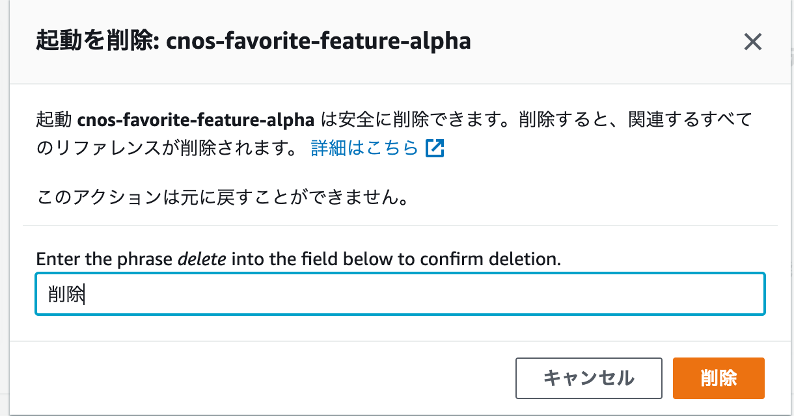

# Evidentlyのリソース削除の方法

- AWSマネジメントコンソール上から、サービスの検索で[cw]と入力し、表示されるサービス一覧から[CloudWatch]を選択します。
- 左ペインから[Evidently]を選択します。
- プロジェクトで、[cnos]から始まる、対象のプロジェクトを選択します。
- 起動タブへ遷移し、[cnos]から始まる起動を選択します。
- [アクション]→[完了としてマーク]を押し、起動を完了させます。
- 完了後、再度[cnos]から始まる、起動を選択して、[アクション]→[起動を削除]を押します。
- 削除ポップアップ表示されます。画面上では、「delete」と入力せよと指示がありますが、**テキストに「削除」と入力して削除してください**（AWSのリソース削除確認で、たまにある騙しパターンです・・・）。

- 次に機能タブへ遷移し、[cnos]から始まる機能を選択します。
- [アクション]→[機能を削除]を押します。テキストにはさきほど同様に「削除」を入力し、ボタンを押しましょう。
- 最後にプロジェクトです。プロジェクトのダッシュボードに戻り、[cnos]からはじまる対象のプロジェクトを選択します。
- [プロジェクトアクション]→[プロジェクトを削除]を押します。テキストにはさきほど同様に「削除」を入力し、ボタンを押しましょう。

 
以上で、Evidentlyの削除が完了です。
削除お疲れ様でした。

全体の削除手順に戻るには[こちら](./README.md)