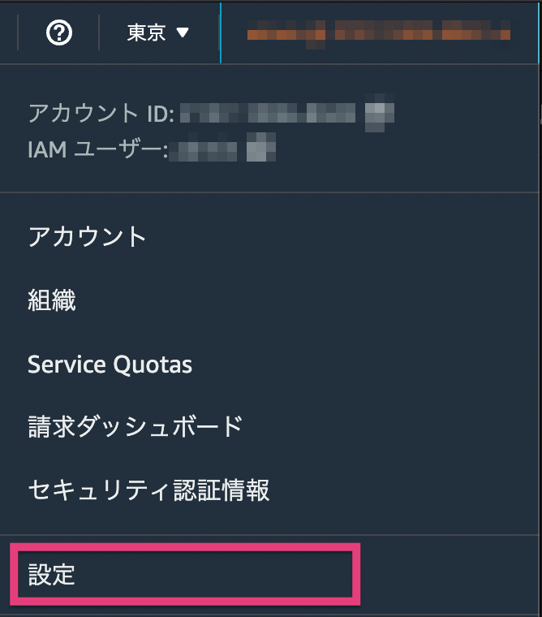

# Application Insightsに関連するリソース削除手順

本手順の実施内容は次の通りです。

1. 作成したApplicationの定義削除

## 作成したApplicationの定義削除

Application Insightsの削除ですが、筆者にて検証したところ、マネジメントコンソールが日本語に設定されているケースではうまくリソースが削除できないことを確認しています。
そのため、ローカリゼーション設定より、言語を[日本語]から[English(US)]に変更した上で実施してください。

1. AWSマネジメントコンソール上から、サービスの検索で[cw]と入力し、表示されるサービス一覧から[CloudWatch]を選択します。
2. 左ペインのメニューから[Insights]メニューを開き、[Application Insights]を選択します。
3. [List view]タブを選択し、[ApplicationInsights-cnos-app-insight-test]のチェックボックスにチェックを入れます。
4. [Action]→[Delete]を押すと、削削除する旨のメッセージボックスが表示されるので、テキストフィールドに[delete]と入力して、[Delete]ボタンを押してください。
5. AWSマネジメントコンソール上部に[ApplicationInsights-cnos-app-insight-test has been deleted. It may take a minute for removal.]とメッセージが表示されればOKです。
6. 少し時間をおき、Application Insightsが削除されることを確認してください(筆者が実施したところ約3分ほど時間を要しました)。

以上でApplication Insightsに関するリソース削除は完了です。

全体の削除手順に戻るには[こちら](./README.md)